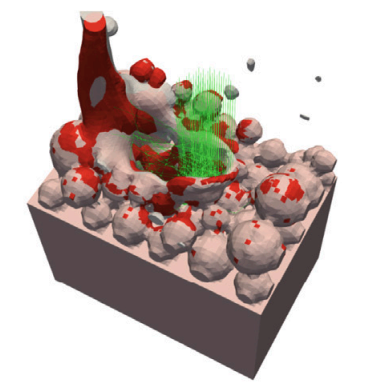
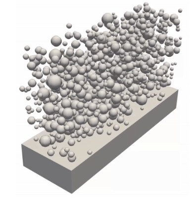
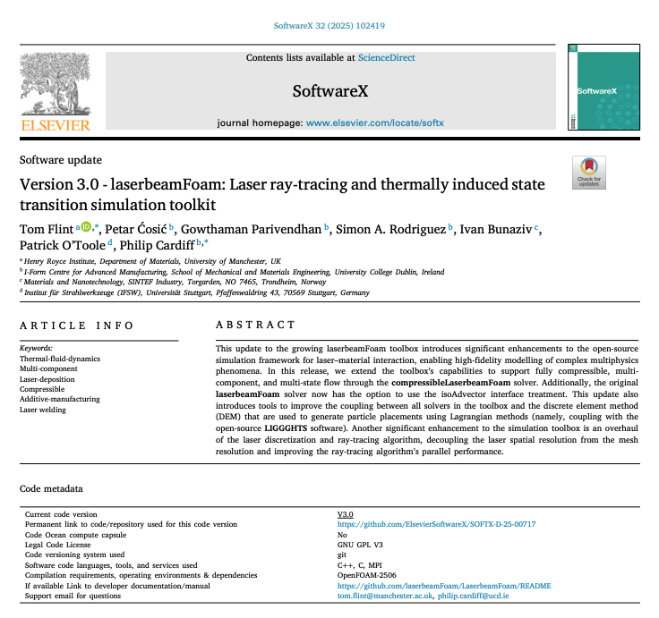
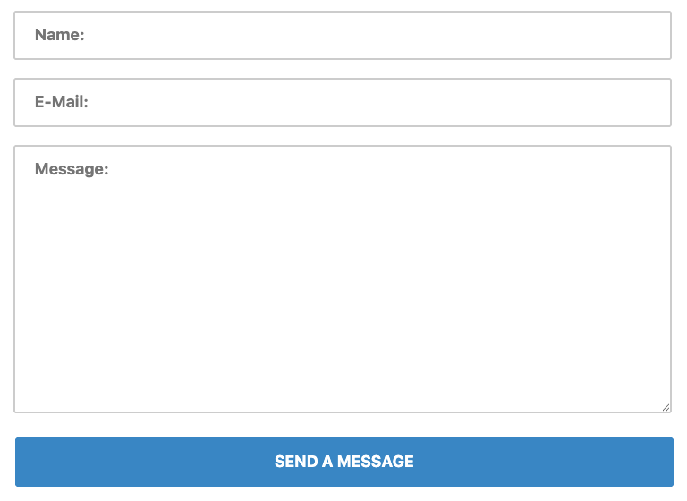

  

 

{:target="_blank"}
{:target="_blank"}
{:target="_blank"}
{:target="_blank"}
<!-- {:target="_blank"} -->

---

## Welcome

Welcome to laserbeamFoam, an open-source collection of OpenFOAM solvers and utilities for modelling laser-based manufacturing and melting processes.
These solvers are used in research and industry for applications such as Laser Powder Bed Fusion, selective laser melting, and laser welding.

## Where do I start?

 

    

     
    

     The <b>Solvers</b> page provides a list of available solvers and their descriptions along with some tutorials and guides on installations.
    

     

    

    
    

     The <b>Utilities</b> page provides a list of available utilities, their use and installation instructions, along with additional tools for the workflow.
    

   

       
 
    
    

     The <b>Publications</b> page provides the list of research papers relevant to a specific solver. Make sure to also check out the <b>how to cite</b> page.
    

    

    
 
    
    

      The <b>contact</b> page provides more details on how to get in touch with the team either by email or by filling out the form. 
    

    

   
<!-- # What is the Laser Melting Suite?

The <strong>Laser Melting Suite</strong> is a collection of <strong>OpenFOAM</strong> solvers and utilities designed for simulating laser melting processes in Laser Powder Bed Fusion, selective laser melting, laser welding and many others. The suite includes solvers for both 2D and 3D simulations. The solvers are designed to be easy to use and flexible, allowing users to customize them for their specific needs. -->

<!-- # Where do I start?
* The [Solvers](solvers/solvers.html) page provides a list of available solvers and their descriptions along with some tutorials and guides on installations.
* The [Utilities](utilities/utilities.html) page provides a list of available utilities, their use and installation instructions.
* The Documentation page is present within every solver page and it provides a description of the algorithms and equations used in the solvers and utilities.
* The [Publications](publications/publications.html) page provides the list of research papers relevant to a specific solver. Make sure to check out the [how to cite](how_to_cite/how_to_cite.html) page if you are planning to use one of the solvers for a publication. -->
