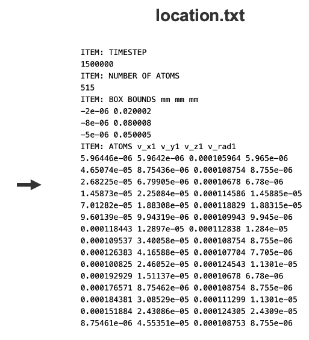
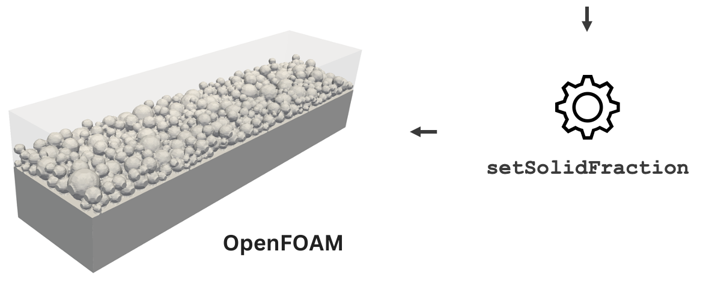

# setSolidFraction

 

 
   
  

 
 
 
 

## Description

<b>setSolidFraction</b> is an OpenFOAM utility that can be used for initialising the volume fraction field based on the particle location file that was obtained from the LIGGGHTS discrete element method simulation, and optionally, the bedPlateDict file that specifies the bed plate dimensions.